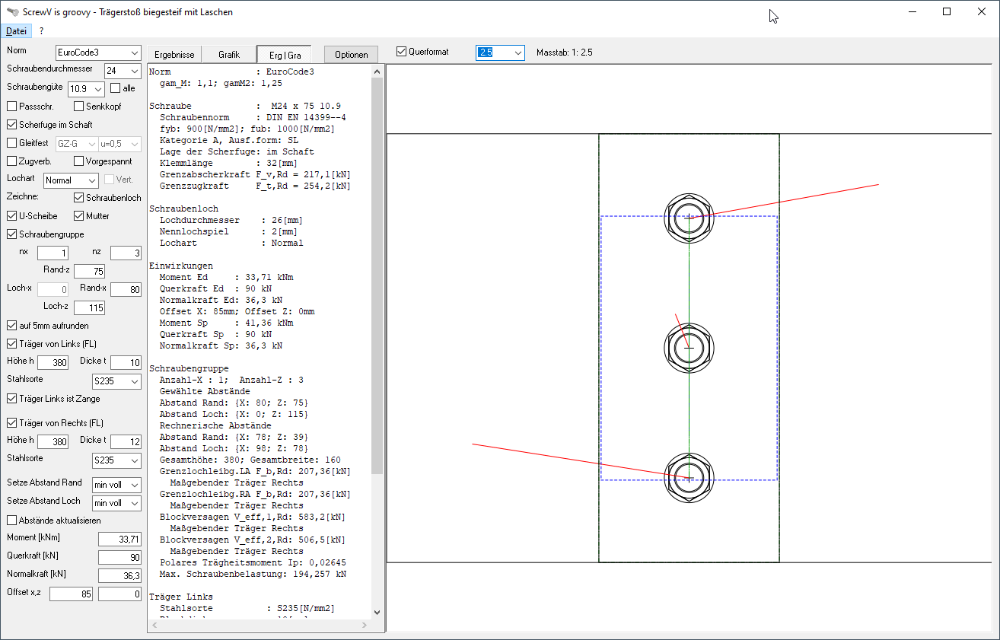

# Eng_ScrewV  
## Screw-V is groovy, calculation of bolted steel connections due to DIN EN 1993
 

Beside the file ScrewV.exe you need the following additional files:
* DirectCOM.dll
* vb_cairo_sqlite.dll
* vbRichClient5.dll  
You can find the files in the zip. You need the Version 5 of the dlls.  
However the new version 6 is available on www.vbrichclient.com  
Project started in july 2015

